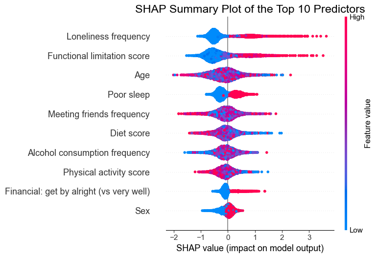
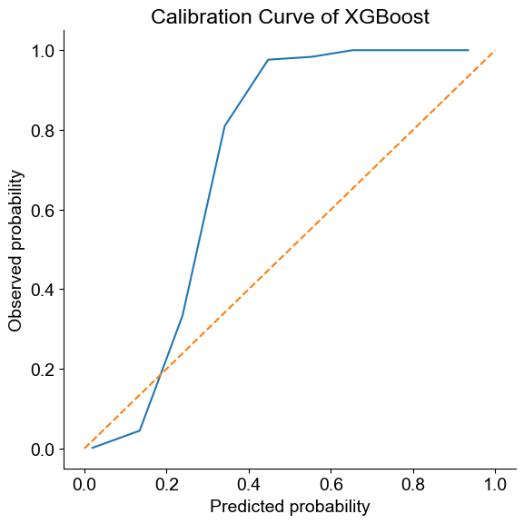
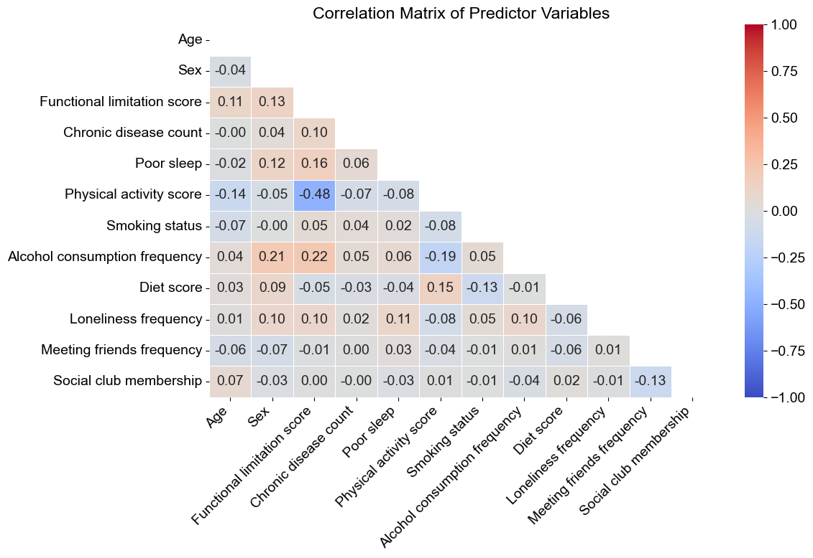
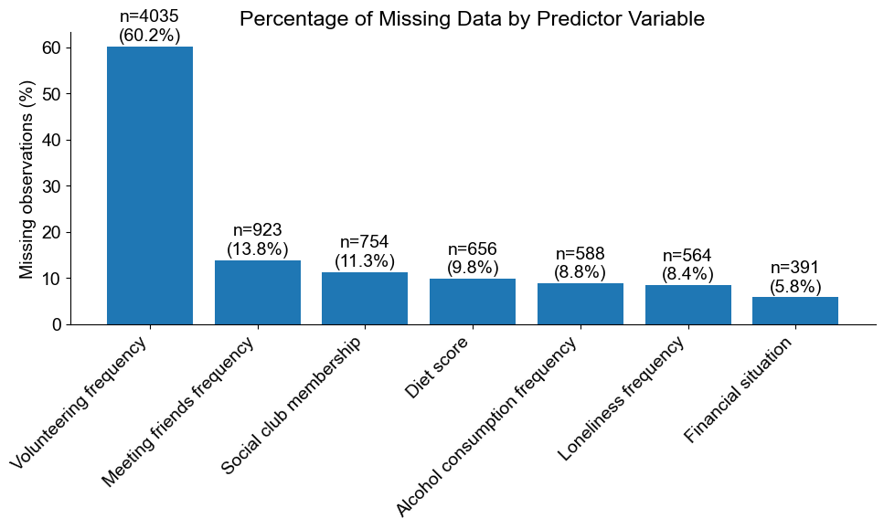

# Predicting Incident Depression in Older Adults Using Interpretable Machine Learning

An interpretable machine learning analysis of incident depression in older adults using longitudinal data from the English Longitudinal Study of Ageing (ELSA).

This project was completed as part of my MSc Data Science dissertation at the University of Sheffield.

## Project Overview

Depression in later life is associated with substantial health and social consequences. This project investigated whether sociodemographic, health, behavioural and social factors could predict incident depression among older adults.

Three predictive models were compared:

- Logistic Regression
- Random Forest
- XGBoost

The analysis also examined model interpretability, calibration, predictor domains, demographic subgroups and temporal changes in selected predictors.

## Methods

The analysis included:

- Data cleaning and feature engineering
- Iterative imputation of missing data
- One-hot encoding of categorical variables
- Multicollinearity assessment
- Stratified five-fold cross-validation
- Logistic Regression
- Random Forest
- XGBoost
- Hyperparameter tuning
- Calibration analysis
- SHAP analysis
- Permutation importance
- Domain-specific modelling
- Age and sex subgroup analysis
- Temporal analysis
- Sensitivity analysis

## Model Performance

| Model | AUROC |
| --- | ---: |
| Logistic Regression | 0.759 |
| Random Forest | 0.726 |
| XGBoost | 0.668 |

Logistic Regression achieved the strongest overall discrimination.

The models showed high specificity but low sensitivity, highlighting the difficulty of identifying incident depression within an imbalanced cohort.

## Key Findings

- Loneliness frequency and functional limitation were among the most influential predictors.
- Poor sleep and physical activity also contributed to prediction.
- Health and social predictor domains provided stronger standalone discrimination than behavioural and sociodemographic domains.
- Temporal change variables did not improve prediction over baseline measurements.
- Predictive performance varied modestly across age and sex subgroups.
- More complex machine learning models did not outperform Logistic Regression.

## Visualisations

### Predictor Importance

SHAP analysis identified the predictors with the greatest influence on XGBoost predictions.

### Model Calibration

Calibration analysis compared predicted probabilities from XGBoost with observed outcome frequencies.

### Predictor Correlations

Correlations between the main predictor variables were examined before modelling.

### Missing Data

Missingness was assessed before iterative imputation.

## Technologies

- Python
- pandas
- NumPy
- scikit-learn
- XGBoost
- SHAP
- statsmodels
- SciPy
- Matplotlib
- Seaborn

## Data

This project uses data from the English Longitudinal Study of Ageing (ELSA).

The underlying ELSA datasets are not included in this repository due to data access and licensing restrictions. Researchers wishing to reproduce the analysis must obtain the appropriate ELSA datasets separately.

## Repository Contents

`depression_prediction.ipynb` contains the data preprocessing, exploratory analysis, predictive modelling, evaluation and interpretability analyses used in the project.

## Author

Uche Dumzo-Ajufo

MSc Data Science, University of Sheffield
